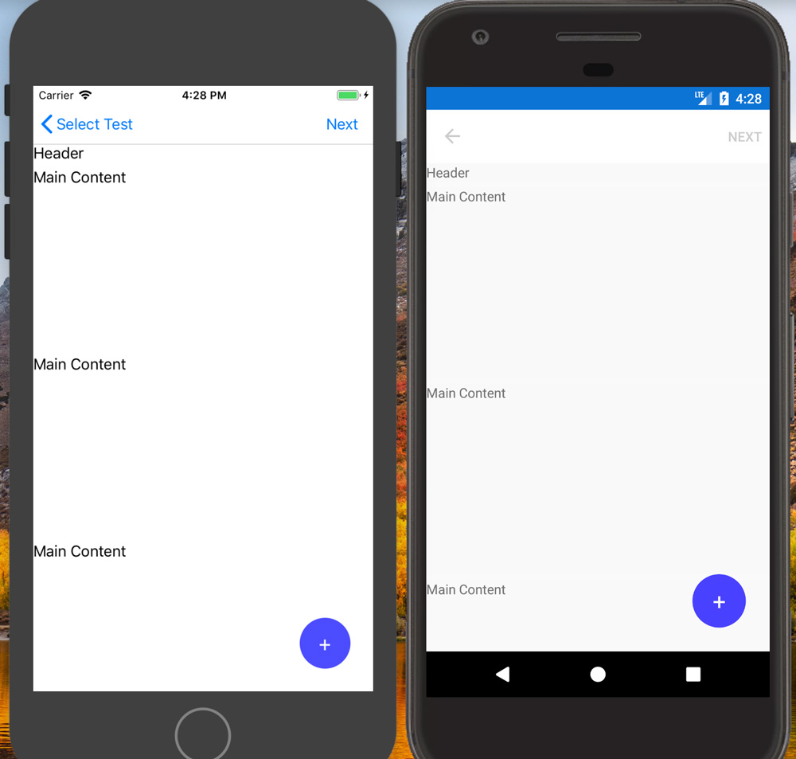

# AiForms.Effects for Xamarin.Forms

AiForms.Effect は Android と iOS に特化することにより、標準のコントロールをより便利にするための機能を提供する Xamarin.Forms の Effectsライブラリです。


## 機能
* [Floating](#floating)
    * ページの前面の任意の場所に複数のフローティングな要素(FABなど)を配置します。
* [Feedback](#feedback)
    * タッチフィードバック効果（色やシステム音）を追加。コマンドは含みません。
* [AddTouch](#addtouch)
    * 各種タッチイベントを追加
* [SizeToFit](#sizetofit)
    * フォントサイズをLabelの大きさに調整
* [Border](#border)
    * 罫線の追加.
* [ToFlatButton](#toflatbutton)
	* ボタンをフラットにする (Android)
* [AddText](#addtext)
	* 1行テキストを任意のviewに追加
* [AddCommand](#addcommand)
    * コマンドを任意のviewに追加
* [AddNumberPicker](#addnumberpicker)
    * NumberPicker 機能を任意のviewに追加
* [AddTimePicker](#addtimepicker)
	* TimePicker 機能を任意のviewに追加
* [AddDatePicker](#adddatepicker)
	* DatePicker 機能を任意のviewに追加
* [AlterLineHeight](#alterlineheight)
    * LabelとEditorの行の高さを変更
* [AlterColor](#altercolor)
	* 通常変えられない箇所の色を変える
* [Placeholder](#placeholder)
	* Editor に Placeholder を追加.

## **トリガープロパティ (1.4.0~)**

EffectのOn・OffはそれぞれのOnプロパティで操作していましたが、ver.1.4.0よりEffectの主要なプロパティを設定するだけで起動できるようになりました。
このプロパティはトリガープロパティとします。
例えば、AddCommandの場合は Command や LongCommand がトリガープロパティになります。このドキュメントに該当のプロパティには trigger と記載しています。

### 旧 (~1.3.1)

```xml
<Label Text="Text" ef:AddCommand.On="true" ef:AddCommand.Command="{Binding GoCommand}" />
```
必ずOnの指定が必要。

### 新 (1.4.0~)

```xml
<Label Text="Text" ef:AddCommand.Command="{Binding GoCommand}" />
```

Trigger Propertyを指定していれば On は不要。

### 旧方式のままを保つには

Onプロパティを使用して動的にEffectの有効無効を切り替えて使用していた場合は、Trigger Property方式だとうまく動作しなくなる可能性があります。
従来の動きのままにする場合は .NETStandard プロジェクトの任意の場所に以下のように記述することで無効化できます。

```csharp
AiForms.Effects.EffectConfig.EnableTriggerProperty = false;
```

## 動作条件など

iOS:iPhone5s,iPod touch6,iOS9.3  
Android:version 5.1.1 (only FormsAppcompatActivity) / API22

## Nuget インストール

```bash
Install-Package AiForms.Effects
```

共有プロジェクト（PCL / .NETStandard）と各プラットフォームのプロジェクトにそれぞれインストールする必要があります。

### iOS プロジェクト

iOSで使用するために、AppDelegate.csに以下のようなコードの追加が必要です。

```csharp
public override bool FinishedLaunching(UIApplication app, NSDictionary options) {
    
    global::Xamarin.Forms.Forms.Init();
    AiForms.Effects.iOS.Effects.Init();  //need to write here

    return base.FinishedLaunching(app, options);
}
```

### Android プロジェクト

MainActivity.cs に以下のようなコードを追記します。

```csharp
protected override void OnCreate(Bundle bundle) {
            
    base.OnCreate(bundle);

    global::Xamarin.Forms.Forms.Init(this, bundle);
    AiForms.Effects.Droid.Effects.Init(); //need to write here
    ...
}
```

## Floating

ページの上の任意の場所に複数のフローティングView (Floating Action Buttonなど) を配置するEffectです。
配置されは要素はContentPageより前面に表示され、ContentPageのスクロールの影響を受けません。

### 使い方

このサンプルでは、垂直下端から上に25dp、水平右端から左に25dpの位置に配置しています。

```xml
<ContentPage xmlns:ef="clr-namespace:AiForms.Effects;assembly=AiForms.Effects">
    
    <ef:Floating.Content>
        <ef:FloatingLayout>
            <!-- 右下から上に25dp 左に25dp -->
            <ef:FloatingView 
                VerticalLayoutAlignment="End" 
                HorizontalLayoutAlignment="End"
                OffsetX="-25" OffsetY="-25" >
                 <!-- Code behindのハンドラ指定やViewModelのBindingも可能 -->
                 <Button Clicked="BlueTap" BackgroundColor="{Binding ButtonColor}" 
                         BorderRadius="28" WidthRequest="56" HeightRequest="56" 
                         Text="+" FontSize="24"
                         TextColor="White" Padding="0" />
            </ef:FloatingView>
        </ef:FloatingLayout>
    </ef:Floating.Content>

    <StackLayout>
        <Label Text="MainContents" />
    </StackLayout>
</ContentPage>
```

 

### Property

* Content (trigger)
    * FloatingViewを配置するためのルート要素で FloatingLayoutクラスです。

### FloatingLayout

ページ上に複数のFloatingViewを自由に配置できるレイアウト要素です。

### FloatingView

FloatingLayoutによって配置される要素です。
このViewは、HorizontalLayoutAlignment, VerticalLayoutAlignment, OffsetX, OffsetX を指定して自身の位置を決めるために使用します。
このViewの子要素には任意のVisualElementを配置できます。

#### Properties

* HorizontalLayoutAlignment (defalut: Center)
    * 水平方向の位置の列挙値 (Start / Center / End / Fill)
* VerticalLayoutAlignment (defalut: Center)
    * 垂直方向の位置の列挙値 (Start / Center / End / Fill)
* OffsetX
    * 水平方向の位置の調整値。HorizontalLayoutAlignmentからの相対値を指定します。(Fillの場合は無効)
* OffsetY
    * 垂直方向の位置の調整値。VerticalLayoutAlignmentからの相対値を指定します。(Fillの場合は無効)
* Hidden
    * Viewを表示するか非表示にするかのbool値。
    * AndroidでIsVisibleがfalseの状態でページを表示すると、それ以降falseにした要素をtrueにしても表示されなくなる問題があり、それを回避するためのプロパティです。もしIsVisibleで問題がある場合はこちらを使用してください。
    * 内部でOpacityとInputTransparentプロパティを利用しています。

## Feedback

これは任意のviewにタッチフィードバック（押した感）を追加するEffectで、以前のバージョンでAddCommandに含まれていた機能を独立させたものです。
このeffectは他のeffect （例えば AddNumberPickerやAddDatePickerなど）と同時に使用することができます。
ただし、AddCommandには既にこの機能が含まれているため併用することはできません。

### Properties

* EffectColor (trigger)
    * タッチフィードバックの色。 (default: transparent)
* EnableSound (trigger)
    * タッチフィードバックのシステム音。 (default: false)

## AddTouch

これはタッチイベント（begin, move, end, cancel）をviewに追加する Effect です。
それぞれのタッチイベントにはlocationプロパティが提供され、X・Y座標を取得できます。

### Properties

* On
    * Effect On / Off

> このeffectには他にプロパティが存在しないため On プロパティで制御してください。

### TouchRecognizer events

* TouchBegin
* TouchMove
* TouchEnd
* TouchCancel

### Demo

https://youtu.be/9zrVQcr_Oqo

### 使い方

この Effect の使い方 は他のEffectと少し違っています。
まず XAML で `On` 添付プロパティをコントロールにセットし、その値をtrueにします。

```xml
<?xml version="1.0" encoding="UTF-8"?>
<ContentPage 
    ...
    xmlns:ef="clr-namespace:AiForms.Effects;assembly=AiForms.Effects">
    <StackLayout HeightRequest="300" ef:AddTouch.On="true" x:Name="container" />
</ContentPage>
```

その後 コードビハインドで `AddTouch.GetRecognizer` メソッドを使って、`TouchRecognizer` を取得し、この recognizer を使ってそれぞれのタッチイベントをハンドルします。

```cs
var recognizer = AddTouch.GetRecognizer(container);

recognizer.TouchBegin += (sender, e) => {
    Debug.WriteLine("TouchBegin");
};

recognizer.TouchMove += (sender, e) =>  {
    Debug.WriteLine("TouchMove");
    Debug.WriteLine($"X: {e.Location.X} Y:{e.Location.Y}"); 
};

recognizer.TouchEnd += (sender, e) => {
    Debug.WriteLine("TouchEnd");
};

recognizer.TouchCancel += (sender, e) => {
    Debug.WriteLine("TouchCancel");
};
```

## SizeToFit

これは Labelの大きさに合わせてフォントサイズをフィットさせる Effect で、Label専用です。

### Properties

* On
    * Effect On/Off (true is On)
* CanExpand
    * フィットさせるときにフォントサイズを拡大させるかどうか (Default true)
    * falseの場合、フォントサイズは拡大はせず、縮小だけします。

> このeffectには他にプロパティが存在しないため On プロパティで制御してください。

### Demo

https://youtu.be/yMjcFOp38XE

### Xamlでの使用法

```xml
<ContentPage 
	xmlns="http://xamarin.com/schemas/2014/forms" 
	xmlns:x="http://schemas.microsoft.com/winfx/2009/xaml" 
	xmlns:ef="clr-namespace:AiForms.Effects;assembly=AiForms.Effects"
	x:Class="AiEffects.TestApp.Views.BorderPage">
	<Label Text="LongText..." ef:SizeToFit.On="true" ef.SizeToFit.CanExpand="false"
			HeightRequest="50" Width="200"  />
</ContentPage>
```

## Border

これは任意のviewに罫線を追加する Effect です。
Entry・Picker・DatePicker・TimePickerはiOSではデフォルトで罫線を持っていますが、widthを0に指定することで罫線を非表示にすることができます。

 

### Properties

* On
	* Effect On/Off (true is On)
* Width (trigger)
	* Border width (default 0)
* Color
	* Border color (default transparent)
* Radius (trigger)
	* Border radius (default 0)

### Xamlでの使用法

```xml
<ContentPage 
	xmlns="http://xamarin.com/schemas/2014/forms" 
	xmlns:x="http://schemas.microsoft.com/winfx/2009/xaml" 
	xmlns:ef="clr-namespace:AiForms.Effects;assembly=AiForms.Effects"
	x:Class="AiEffects.TestApp.Views.BorderPage">
	<StackLayout Margin="4" 
        ef:Border.Width="2" ef:Border.Radius="6" ef:Border.Color="Red">
		<Label Text="hoge" />
        <Label Text="fuga" />
	</StackLayout>
</ContentPage>
```

### 制限事項

* Android の Entry・Picker・DatePicker・TimePicker の 入力欄の下線は、この Effect を使うと非表示になります。
* Android の Button では正しく表示されません。Buttonには [ToFlatButton](#toflatbutton)を使用してください。
* Android の WebView・Frame・ScrollView は動作対象外です。
* Android の ListView と TableView は罫線から背景がはみ出します。
* AddCommand と同時に使用することは動作対象外です。

## ToFlatButton

これは Android で Button をフラットに変える Effect です。
このEffectを使うことで、 iOSっぽいボタンデザインにすることができます。
またこのEffectは Android でButtonのプロパティの BorderRadius, BorderWidth, BorderColorを使用可能にします。

 

### Supported View

* Button (Android)

### Properties

* On
    * Effect On/Off (true is On)
* RippleColor (trigger)
	* Ripple effect color.(default none)


### Xamlでの使用法

```xml
<Button Text="ButtonText" 
	ef:ToFlatButton.On="true" 
	ef:ToFlatButton.RippleColor="Red"
	BorderWidth="4" BorderColor="Green" BorderRadius="10" 
/>
```

## AddText

これは任意のviewに1行テキストを追加するEffectです。
このEffectを使うと、例えばバリデーションや文字カウントなどの情報を表示することができます。
またテキストの位置（左上・右上・右下・左下）、テキスト色、フォントサイズ、マージンなどをプロパティを指定できます。

 

### Supported View

* Label
* Entry
* Editor
* StackLayout
* AbsoluteLayout

### Properties

* On
	* Effect On/Off (true is On)
* Text
	* added text
* TextColor
	* Default Red
* BackgroundColor
	* BackgroundColor of inner text view.
	* Default Transparent
* FontSize
	* Default 8
* Margin
	* Distance from a side of target view to inner text view.
	* Default 0,0,0,0
* Padding
	* Padding of inner text view. 
	* Default 0,0,0,0
* HorizontalAlign
	* horizontal text position(Start or End). Default End.
* VerticalAlign
	* vertical text position(Start or End). Default Start.

### Xamlでの使用方法

```xml
<ContentPage 
	xmlns="http://xamarin.com/schemas/2014/forms" 
	xmlns:x="http://schemas.microsoft.com/winfx/2009/xaml" 
	xmlns:ef="clr-namespace:AiForms.Effects;assembly=AiForms.Effects"
	x:Class="AiEffects.TestApp.Views.AddTextPage">
	<StackLayout Margin="4">
		<Entry HorizontalOptions="FillAndExpand" Text="{Binding Title}"
			ef:AddText.On="true" ef:AddText.TextColor="Red" 
			ef:AddText.FontSize="10" ef:AddText.Margin="4,8,4,8" 
			ef:AddText.Padding="2,4,2,4" ef:AddText.BackgroundColor="#A0F0F0E0"
			ef:AddText.HorizontalAlign="End"
			ef:AddText.VerticalAlign="Start" 
			ef:AddText.Text="{Binding TitleMessage}" />
	</StackLayout>
</ContentPage>
```

### 制限事項

Androidの場合、デバイスを回転したときテキストの位置が正しくなりません。

## AddCommand

これは任意のviewにCommandの機能を追加するEffectです。
タップとロングタップにそれぞれのCommandとParameterを設定できます。

### Supported View (in case Xamarin.Forms 3.6.0)

|                   | iOS | Android |
| ----------------- | --- | ------- |
| ActivityIndicator | ✅   | ✅       |
| BoxView           | ✅   | ✅       |
| Button            | ✅   | ✅       |
| DatePicker        | ❌   | ✅       |
| Editor            | ❌   | ❌       |
| Entry             | ❌   | ❌       |
| Image             | ✅   | ✅       |
| Label             | ✅   | ✅       |
| ListView          | ✅   | ❌       |
| Picker            | ❌   | ✅       |
| ProgressBar       | ✅   | ✅       |
| SearchBar         | ❌   | ❌       |
| Slider            | ✅   | ❌       |
| Stepper           | ✅   | ❌       |
| Switch            | ❌   | ❌       |
| TableView         | ❌   | ❌       |
| TimePicker        | ❌   | ✅       |
| WebView           | ❌   | ❌       |
| ContentPresenter  | ✅   | ✅       |
| ContentView       | ✅   | ✅       |
| Frame             | ✅   | ❌       |
| ScrollView        | ❌   | ❌       |
| TemplatedView     | ✅   | ✅       |
| AbsoluteLayout    | ✅   | ✅       |
| Grid              | ✅   | ✅       |
| RelativeLayout    | ✅   | ✅       |
| StackLayout       | ✅   | ✅       |

### Properties

* On
    * Effect On/Off (true is On)
* Command (trigger)
    * タップ時のCommand
* CommandParameter
    * タップ時のCommandParameter
* LongCommand (trigger)
    * ロングタップ時のCommand
* LongCommandParameter
    * ロングタップ時のCommandParameter
* EffectColor
    * タップした時の背景色。(Default: transparent)
* ~~EnableRipple~~
    * ~~Ripple Effect On/Off (default true,android only)
      Rippleを使いたくない場合はfalseに設定してください。~~
    * ver.1.4.0 で廃止されました。
* EnableSound
    * タップしたときにシステム音を鳴らします。(Default false)
* SyncCanExecute
    * CommandのCanExecuteとviewのIsEnableを同期させるかどうか(Default false)
    * trueにするとviewはCanExecuteがfalseの場合はdisableっぽい外観になります。

### Xamlでの使用法

```xml
<ContentPage xmlns="http://xamarin.com/schemas/2014/forms"
		xmlns:x="http://schemas.microsoft.com/winfx/2009/xaml"
		xmlns:ef="clr-namespace:AiForms.Effects;assembly=AiForms.Effects"
		x:Class="AiEffects.Sample.Views.AddCommandPage">

        <StackLayout>
    		<Label Text="Label"
    			ef:AddCommand.On="true"
    			ef:AddCommand.EffectColor="#50FFFF00"
    			ef:AddCommand.Command="{Binding EffectCommand}"
    			ef:AddCommand.CommandParameter="Label"
                ef:AddCommand.LongCommand="{Binding LongTapCommand}"
                ef:AddCommand.LongCommandParameter="LongTap" />
        </StackLayout>
</ContentPage>
```

### 制限事項

**Android**

* AiForms.Effects 1.1.0 以上で Layout系の要素にRippleを適用した場合、子のInputTrasparentは動作しなくなります。

### Tips

#### システム音の変更

AppDelegate
```cs
public override bool FinishedLaunching(UIApplication app, NSDictionary options) {
    global::Xamarin.Forms.Forms.Init();

    AiForms.Effects.iOS.Effects.Init();
    //here specify sound number
    AiForms.Effects.iOS.FeedbackPlatformEffect.PlaySoundNo = 1104;
    ...
}
```

MainActivity
```cs
protected override void OnCreate(Bundle bundle) {
    
    base.OnCreate(bundle);
    ...
    
    global::Xamarin.Forms.Forms.Init(this, bundle);
    
    //here specify SE
    AiForms.Effects.Droid.FeedbackPlatformEffect.PlaySoundEffect = Android.Media.SoundEffect.Spacebar;
    
    ...
}
```

#### Imageへ使用する場合

Ripple エフェクトはフォアグラウンドで発生せずにバックグラウンドとして発生していまいます。この場合はLayoutでラップすると回避できます。

```xml
<StackLayout ef:AddCommand.On="{Binding EffectOn}"
			 ef:AddCommand.EffectColor="{Binding EffectColor}">
    <Image Source="image" />
</StackLayout>
```

## AddNumberPicker

このEffectは任意のviewに NumberPicker の機能を追加します。
viewをタップするとPickerが表示され、数値を選択すると、それが Numberプロパティに反映されます。この時 Commandプロパティを設定していれば、それも実行されます。

 

### Supported View

* Label
* BoxView
* Button
* Image
* StackLayout
* AbsoluteLayout

他はだいたいAddCommandと同じです。

### Properties

* On
    * Effect On/Off (true is On)
* Min
	* minimum number(positive integer)
* Max
	* maximum number(positive integer)
* Number (trigger)
	* current number(default twoway binding)
* Title
	* Picker Title(optional)
	* iOSではこれが長すぎると外観を損ねるので注意してください。
* Command
    * command invoked when a number was picked(optional)


### Xamlでの使用法

```xml
<ContentPage xmlns="http://xamarin.com/schemas/2014/forms"
		xmlns:x="http://schemas.microsoft.com/winfx/2009/xaml"
		xmlns:ef="clr-namespace:AiForms.Effects;assembly=AiForms.Effects"
		xmlns:prism="clr-namespace:Prism.Mvvm;assembly=Prism.Forms"
		prism:ViewModelLocator.AutowireViewModel="True"
		x:Class="AiEffects.Sample.Views.AddNumberPickerPage"
		Title="AddNumberPicker">
	<StackLayout>
		<Label Text="Text"
			ef:AddNumberPicker.On="true"
			ef:AddNumberPicker.Min="10"
			ef:AddNumberPicker.Max="999"
			ef:AddNumberPicker.Number="{Binding Number}"
			ef:AddNumberPicker.Title="Select your number"
            ef:AddNumberPicker.Command="{Binding SomeCommand}" />
    </StackLayout>
</ContentPage>
```

## AddTimePicker

これは任意のviewに TimePicker を追加するEffectです。
viewをタップするとPickerが表示され、時間を選択すると、それが Time プロパティに反映されます。この時 Command プロパティを設定していれば、それも実行されます。

### Properties

* On
    * Effect On/Off (true is On)
* Time (trigger)
	* current time(default twoway binding)
* Title
	* Picker Title(optional)
	* iOSではこれが長すぎると外観を損ねるので注意してください。
* Command
    * command invoked when a time was picked(optional)

## AddDatePicker

これは、任意のviewに DatePicker の機能を追加する Effectです。
viewをタップするとPickerが表示され、日付を選択すると、それが Date プロパティに反映されます。この時 Command プロパティを設定していれば、それも実行されます。

### Properties

* On
    * Effect On/Off (true is On)
* MinDate
	* minimum date(optional)
* MaxDate
	* maximum date(optional)
* Date (trigger)
	* current date(default twoway binding)
* TodayText
	* 今日 を選択するためのボタンのタイトル(optional / only iOS)
	* このプロパティを設定すると「今日」ボタンが表示され、タップすると今日が選択されます。
* Command
    * command invoked when a date was picked(optional)

## AlterLineHeight

このEffectは Label と Editor で行間・行高を変更します。

 

### Supported View

* Label
* Editor

### Properties

* On
    * Effect On/Off (true is On)
* Multiple (trigger)
	* フォントサイズに対する倍率
	* フォントの高さ * この倍率 が 行の高さになります。

### Xamlでの使用法

```xml
<ContentPage xmlns="http://xamarin.com/schemas/2014/forms"
		xmlns:x="http://schemas.microsoft.com/winfx/2009/xaml"
		xmlns:ef="clr-namespace:AiForms.Effects;assembly=AiForms.Effects"
		xmlns:prism="clr-namespace:Prism.Mvvm;assembly=Prism.Forms"
		prism:ViewModelLocator.AutowireViewModel="True"
		x:Class="AiEffects.Sample.Views.AlterLineHeightPage"
		Title="AlterLineHeight">
	<StackLayout BackgroundColor="White" Spacing="4">
		<Label Text="{Binding LabelText}" VerticalOptions="Start" FontSize="12"
			ef:AlterLineHeight.On="true"
			ef:AlterLineHeight.Multiple="1.5"  />
	</StackLayout>
</ContentPage>
```

## AlterColor

これは通常変更できない箇所の色を変更する Effect です。

 

### Supported views

|        | iOS | Android | which part |
| ------ | --- | ------- | ---------- |
| Page   |     | ✅       | Statusbar  |
| Slider | ✅   | ✅       | Trackbar   |
| Switch | ✅   | ✅       | Trackbar   |
| Entry  |     | ✅       | Under line |
| Editor |     | ✅       | Under line |

### Properties

* On
    * Effect On/Off (true is On)
* Accent (trigger)
	* changed color.

### Xamlでの使用法

```xml
<Slider Minimum="0" Maximum="1" Value="0.5" 
	ef:AlterColor.On="true" ef:AlterColor.Accent="Red" />
```

## Placeholder

** この機能は Xamarin.Forms 3.2.0 で実装されました。 **

> 3.2.0より前のバージョンを使っている場合は、このEffectを利用できます。

これは Editor に プレースホルダーを表示する Effectで、Editor専用です。

 

### Properties

* On
	* Effect On/Off (true is On)
* Text (trigger)
	* Placeholder text.
* Color
	* Placeholder color.

### Xamlでの使用法

```xml
<ContentPage 
	xmlns="http://xamarin.com/schemas/2014/forms" 
	xmlns:x="http://schemas.microsoft.com/winfx/2009/xaml" 
	xmlns:ef="clr-namespace:AiForms.Effects;assembly=AiForms.Effects"
	x:Class="AiEffects.TestApp.Views.BorderPage">
	<Editor HeightRequest="150"
		ef:Placeholder.On="true"
		ef:Placeholder.Text="placeholder text"
		ef:Placeholder.Color="#E0E0E0"
	/>
</ContentPage>
```

## Contributors

* [yuka-abn](https://github.com/yuka-abn)
* [gentledepp](https://github.com/gentledepp)

## 寄付

開発継続のため、寄付を募集しています。

寄付をいただけるとやる気が非常にアップしますので、どうかよろしくお願いいたします🙇

* [PayPalMe](https://paypal.me/kamusoftJP?locale.x=ja_JP)

## スポンサー

スポンサーも募集しています。
こちらはサブスクリプション制になります。

* [GitHub Sponsors](https://github.com/sponsors/muak)

## License

MIT Licensed.
