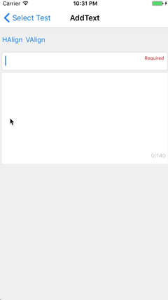
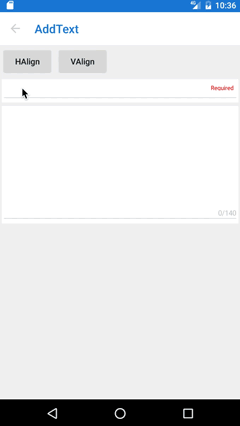
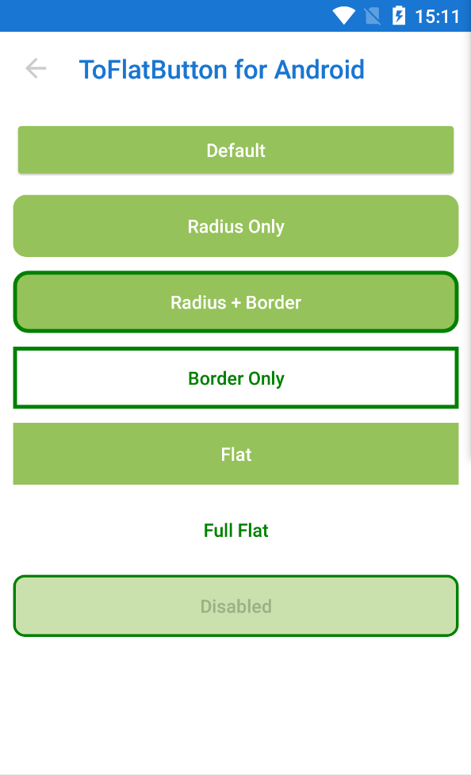
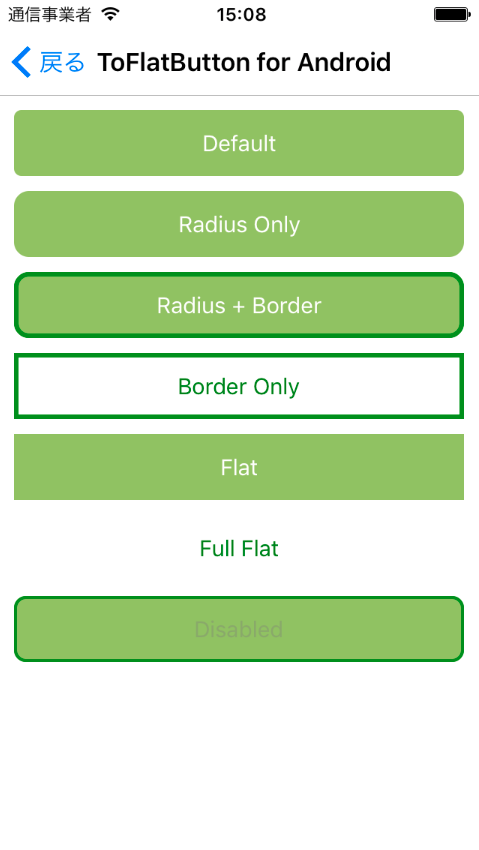
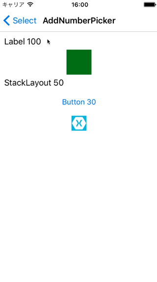
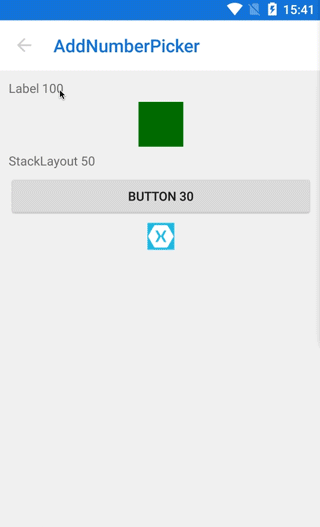
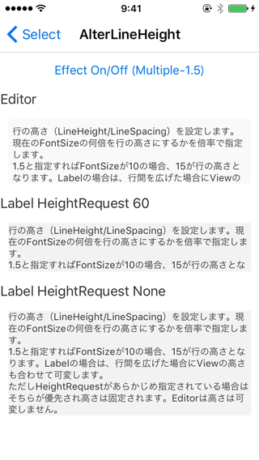
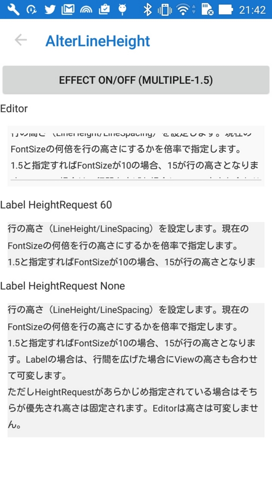

# AiForms.Effects for Xamarin.Forms

Xamarin.Forms Effects for Android / iOS only.

## Features
* [AddText](#addtext)
	* add one line Text to a view.
* [ToFlatButton](#toflatbutton)
	* alter Button to flat (for Android)
* [AddCommand](#addcommand)
    * add Command function to a view.
* [AddNumberPicker](#addnumberpicker)
    * add NumberPicker function to a view.
* [AlterLineHeight](#alterlineheight)
    * alter LineHeight of Label and Editor.


## Minimum Device and Version etc

iOS:iPhone5s,iPod touch6,iOS9.3  
Android:version 5.0〜7.0 (FormsAppcompatActivity only)

## Nuget Installation

```bash
Install-Package AiForms.Effects
```

You need to install this nuget package to PCL project and each platform project.

### for iOS project

To use by iOS, you need to write some code in AppDelegate.cs.

```csharp
public override bool FinishedLaunching(UIApplication app, NSDictionary options) {
    global::Xamarin.Forms.Forms.Init();

    AiForms.Effects.iOS.Effects.Init();  //need to write here

    LoadApplication(new App(new iOSInitializer()));

    return base.FinishedLaunching(app, options);
}
```

## AddText

This is the effect that add one line text into a view.  
If you use this effect, for example you will be able to show a information that validations or character count etc.  
You will be able to change text position(top-left,top-right,bottom-left,bottom-right), text color,font size and margin by specifying property.

 

### Supported View

* Label
* Entry
* Editor
* StackLayout
* AbsoluteLayout

and more.

### Parameters

* On
	* Effect On/Off (true is On)
* Text
	* added text
* TextColor
	* Default Red
* BackgroundColor
	* BackgroundColor of inner text view.
	* Default Transparent
* FontSize
	* Default 8
* Margin
	* Distance from a side of target view to inner text view.
	* Default 0,0,0,0
* Padding
	* Padding of inner text view. 
	* Default 0,0,0,0
* HorizontalAlign
	* horizontal text position(Start or End). Default End.
* VerticalAlign
	* vertical text position(Start or End). Default Start.

### How to write by Xaml

```xml
<ContentPage 
	xmlns="http://xamarin.com/schemas/2014/forms" 
	xmlns:x="http://schemas.microsoft.com/winfx/2009/xaml" 
	xmlns:ef="clr-namespace:AiForms.Effects;assembly=AiForms.Effects"
	x:Class="AiEffects.TestApp.Views.AddTextPage">
	<StackLayout Margin="4">
		<Entry HorizontalOptions="FillAndExpand" Text="{Binding Title}"
			ef:AddText.On="true" ef:AddText.TextColor="Red" 
			ef:AddText.FontSize="10" ef:AddText.Margin="4,8,4,8" 
			ef:AddText.Padding="2,4,2,4" ef:AddText.BackgroundColor="#A0F0F0E0"
			ef:AddText.HorizontalAlign="End"
			ef:AddText.VerticalAlign="Start" 
			ef:AddText.Text="{Binding TitleMessage}" />
	</StackLayout>
</ContentPage>
```

### Limitations

When device rotates, text position will not be right in case android.

## ToFlatButton

This is the effect that alter Button to flat(only Android).  
If this effect is used, you will be able to design like iOS's Button.  
And also this effect will enable BorderRadius, BorderWidth and BorderColor of default button properties to use by Android.

 

### Supported View

* Button (Android)

### Parameters

* On
    * Effect On/Off (true is On)
* RippleColor
	* Ripple effect color.(default none)


### How to write by Xaml

```xml
<Button Text="ButtonText" 
	ef:ToFlatButton.On="true" 
	ef:ToFlatButton.RippleColor="Red"
	BorderWidth="4" BorderColor="Green" BorderRadius="10" 
/>
```

## AddCommand

This Effect add Command function to a view.  
There are properties of Command and Parameter for tap and long tap.

### Supported View (in case Xamarin.Forms 2.3.4)

|                 |iOS |Android|
|-----------------|----|-------|
|ActivityIndicator|✅   |✅      |
|BoxView          |✅   |✅      |
|Button           |✅   |✅      |
|DatePicker       |❌   |✅      |
|Editor           |❌   |❌      |
|Entry            |❌   |❌      |
|Image            |✅   |✅      |
|Label            |✅   |✅      |
|ListView         |✅   |❌      |
|Picker           |❌   |✅      |
|ProgressBar      |✅   |✅      |
|SearchBar        |❌   |❌      |
|Slider           |✅   |❌      |
|Stepper          |✅   |❌      |
|Switch           |❌   |✅      |
|TableView        |❌   |❌      |
|TimePicker       |❌   |✅      |
|WebView          |❌   |❌      |
|ContentPresenter |✅   |✅      |
|ContentView      |✅   |✅      |
|Frame            |✅   |❌      |
|ScrollView       |✅   |❌      |
|TemplatedView    |✅   |✅      |
|AbsoluteLayout   |✅   |✅      |
|Grid             |✅   |✅      |
|RelativeLayout   |✅   |✅      |
|StackLayout      |✅   |✅      |

### Parameters

* On
    * Effect On/Off (true is On)
* Command
    * Tap Command
* CommandParameter
    * Tap Command Parameter
* LongCommand
    * Long Tap Command
* LongCommandParameter
    * Long Tap Command Parameter
* EffectColor
    * background color when to tap.if it doesn't setting,nothing will occur.
* EnableRipple
    * Ripple Effect On/Off (default true,android only)<br>
      If you don't have to use ripple effect,it make EnableRipple false.
* EnableSound
    * When tapped, whether play system sound effect.(Default false)
* SyncCanExecute
    * Whether synchronize Command's CanExecute to xamarin.forms.view's IsEnabled.(Default false)
    * If true, a view become opacity when disabled.

### How to write by Xaml

```xml
<ContentPage xmlns="http://xamarin.com/schemas/2014/forms"
		xmlns:x="http://schemas.microsoft.com/winfx/2009/xaml"
		xmlns:ef="clr-namespace:AiForms.Effects;assembly=AiForms.Effects"
		x:Class="AiEffects.Sample.Views.AddCommandPage">

        <StackLayout>
    		<Label Text="Label"
    			ef:AddCommand.On="true"
    			ef:AddCommand.EffectColor="#50FFFF00"
    			ef:AddCommand.Command="{Binding EffectCommand}"
    			ef:AddCommand.CommandParameter="Label"
                ef:AddCommand.LongCommand="{Binding LongTapCommand}"
                ef:AddCommand.LongCommandParameter="LongTap" />
        </StackLayout>
</ContentPage>
```

### Tips

#### Changing Sound Effect

AppDelegate
```cs
public override bool FinishedLaunching(UIApplication app, NSDictionary options) {
    global::Xamarin.Forms.Forms.Init();

    AiForms.Effects.iOS.Effects.Init();
    //here specify sound number
    AiForms.Effects.iOS.AddCommandPlatformEffect.PlaySoundNo = 1104;
    ...
}
```

MainActivity
```cs
protected override void OnCreate(Bundle bundle) {
    
    base.OnCreate(bundle);
    ...
    
    global::Xamarin.Forms.Forms.Init(this, bundle);
    
    //here specify SE
    AiForms.Effects.Droid.AddCommandPlatformEffect.PlaySoundEffect = Android.Media.SoundEffect.Spacebar;
    
    ...
}
```

#### When using Image

Ripple Effect will not occur foreground. In that case wrap by a layout view.

```xml
<StackLayout ef:AddCommand.On="{Binding EffectOn}"
			 ef:AddCommand.EffectColor="{Binding EffectColor}">
    <Image Source="image" />
</StackLayout>
```

## AddNumberPicker

This Effect add NumberPicker function to a view.<br>
When you tap the view ,Picker is shown. And when you select a number,it reflects to Number property.If you set Command property,it executes.

 

### Supported View

* Label
* BoxView
* Button
* Image
* StackLayout
* AbsoluteLayout

and more. same with AddCommand.

### Parameters

* On
    * Effect On/Off (true is On)
* Min
	* minimum number(positive integer)
* Max
	* maximum number(positive integer)
* Number
	* current number(default twoway binding)
* Title
	* Picker Title(optional)
	* In case iOS,if this is so long,it will be not beautiful.
* Command
    * command invoked when number had picked(optional)


### How to write by Xaml

```xml
<ContentPage xmlns="http://xamarin.com/schemas/2014/forms"
		xmlns:x="http://schemas.microsoft.com/winfx/2009/xaml"
		xmlns:ef="clr-namespace:AiForms.Effects;assembly=AiForms.Effects"
		xmlns:prism="clr-namespace:Prism.Mvvm;assembly=Prism.Forms"
		prism:ViewModelLocator.AutowireViewModel="True"
		x:Class="AiEffects.Sample.Views.AddNumberPickerPage"
		Title="AddNumberPicker">
	<StackLayout>
		<Label Text="Text"
			ef:AddNumberPicker.On="true"
			ef:AddNumberPicker.Min="10"
			ef:AddNumberPicker.Max="999"
			ef:AddNumberPicker.Number="{Binding Number}"
			ef:AddNumberPicker.Title="Select your number"
            ef:AddNumberPicker.Command="{Binding SomeCommand}" />
    </StackLayout>
</ContentPage>
```


## AlterLineHeight

This Effect alter LineHeight of Label and Editor.

 

### Supported View

* Label
* Editor

### Parameters

* On
    * Effect On/Off (true is On)
* Multiple
	* Multiple to the font height.
	* The font height * this multiple will become line height.

### How to write by Xaml

```xml
<ContentPage xmlns="http://xamarin.com/schemas/2014/forms"
		xmlns:x="http://schemas.microsoft.com/winfx/2009/xaml"
		xmlns:ef="clr-namespace:AiForms.Effects;assembly=AiForms.Effects"
		xmlns:prism="clr-namespace:Prism.Mvvm;assembly=Prism.Forms"
		prism:ViewModelLocator.AutowireViewModel="True"
		x:Class="AiEffects.Sample.Views.AlterLineHeightPage"
		Title="AlterLineHeight">
	<StackLayout BackgroundColor="White" Spacing="4">
		<Label Text="{Binding LabelText}" VerticalOptions="Start" FontSize="12"
			ef:AlterLineHeight.On="true"
			ef:AlterLineHeight.Multiple="1.5"  />
	</StackLayout>
</ContentPage>
```

## Contributors

* [yuka-abn](https://github.com/yuka-abn)

## License

MIT Licensed.
