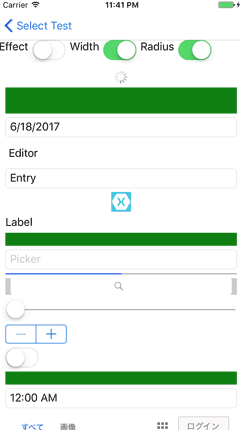
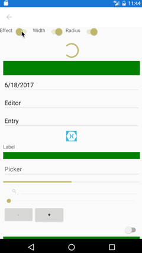
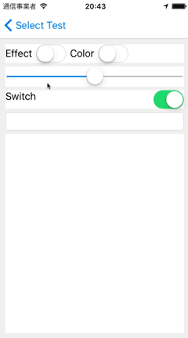
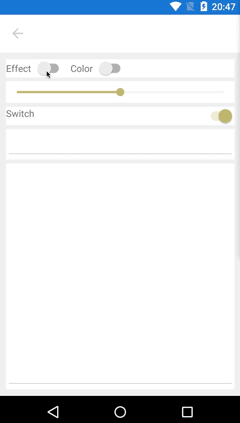
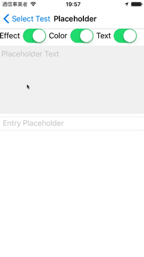
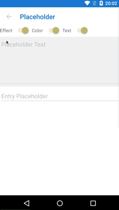

# AiForms.Effects for Xamarin.Forms

AiForms.Effects is the effects library that provides you with more flexible functions than default by targetting only Android and iOS in a Xamarin.Forms project.

[Japanese](./README-ja.md)

## Features
* [Feedback](#feedback)
    * add touch feedback effect (color and sound) without command.
* [AddTouch](#addtouch)
    * add touch event ( begin, move, end, cancel ).
* [SizeToFit](#sizetofit)
    * make font size adjusted to fit the Label size.
* [Border](#border)
    * add border to a view.
* [ToFlatButton](#toflatbutton)
	* alter Button to flat (for Android)
* [AddText](#addtext)
	* add one line Text to a view.
* [AddCommand](#addcommand)
    * add Command function to a view.
* [AddNumberPicker](#addnumberpicker)
    * add NumberPicker function to a view.
* [AddTimePicker](#addtimepicker)
	* add TimePicker function to a view.
* [AddDatePicker](#adddatepicker)
	* add DatePicker function to a view.
* [AlterLineHeight](#alterlineheight)
    * alter LineHeight of Label and Editor.
* [AlterColor](#altercolor)
	* alter Color of an element which it cannot change color.
* [Placeholder](#placeholder)
	* show placeholder on Editor.


## Minimum Device and Version etc

iOS:iPhone5s,iPod touch6,iOS9.3  
Android:version 5.1.1 (only FormsAppcompatActivity) / API22

## Nuget Installation

```bash
Install-Package AiForms.Effects
```

You need to install this nuget package to .NETStandard project and each platform project.

### for iOS project

To use by iOS, you need to write the following code in AppDelegate.cs.

```csharp
public override bool FinishedLaunching(UIApplication app, NSDictionary options) {
    global::Xamarin.Forms.Forms.Init();

    AiForms.Effects.iOS.Effects.Init();  //need to write here

    LoadApplication(new App(new iOSInitializer()));

    return base.FinishedLaunching(app, options);
}
```

## Trigger Property

* On
    * Whether the effect is enabled. If true, add the effect to a view; Otherwise, remove it.


    * Even if this property is not used, setting a trigger property to value can add the effect.
    * **Trigger properties** correspond to main properties such as Command and LongCommand in case of AddCommand Effect.

## Feedback

This is the effect that adds touch feedback effects (color and sound) to a view.
This effect can be made use of with others effect (for example, AddNumberPicker and AddDatePicker) simultaneously.
However, AddCommand can't be used along with this effect because AddCommand contains this functions.

### Properties

* EffectColor (trigger)
    * Touch feedback color. (default: transparent)
* EnableSound (trigger)
    * Touch feedback system sound. (default: false)

## AddTouch

This is the effect that adds touch events (begin, move, end, cancel) to a view.
Each touch events provides location property and can be taken X and Y position.

### Properties

* On
    * Effect On / Off

> Since this effect hasn't any trriger property, control by On property.

### TouchRecognizer events

* TouchBegin
* TouchMove
* TouchEnd
* TouchCancel

### Demo

https://youtu.be/9zrVQcr_Oqo

### How to use

This effect usage is a little different from the other effects.
First of all, set On attached property to a target control and set the value to true in XAML.

```xml
<?xml version="1.0" encoding="UTF-8"?>
<ContentPage 
    ...
    xmlns:ef="clr-namespace:AiForms.Effects;assembly=AiForms.Effects">
    <StackLayout HeightRequest="300" ef:AddTouch.On="true" x:Name="container" />
</ContentPage>
```

In turn, use AddTouch.GetRecognizer method, get a TouchRecognizer in code.
This recognizer can be used to handle each touch events.

```cs
var recognizer = AddTouch.GetRecognizer(container);

recognizer.TouchBegin += (sender, e) => {
    Debug.WriteLine("TouchBegin");
};

recognizer.TouchMove += (sender, e) =>  {
    Debug.WriteLine("TouchMove");
    Debug.WriteLine($"X: {e.Location.X} Y:{e.Location.Y}"); 
};

recognizer.TouchEnd += (sender, e) => {
    Debug.WriteLine("TouchEnd");
};

recognizer.TouchCancel += (sender, e) => {
    Debug.WriteLine("TouchCancel");
};
```

## SizeToFit

This is the effect that make font size adjusted to fit the Label size.
This can be used only Label. 

### Properties

* On
    * Effect On/Off (true is On)
* CanExpand
    * Whether font size is expanded when making it fit. (Default true)
    * If false, font size won't be expanded and only shrinked.

> Since this effect hasn't any trriger property, control by On property.

### Demo

https://youtu.be/yMjcFOp38XE

### How to write with Xaml

```xml
<ContentPage 
	xmlns="http://xamarin.com/schemas/2014/forms" 
	xmlns:x="http://schemas.microsoft.com/winfx/2009/xaml" 
	xmlns:ef="clr-namespace:AiForms.Effects;assembly=AiForms.Effects"
	x:Class="AiEffects.TestApp.Views.BorderPage">
	<Label Text="LongText..." ef:SizeToFit.On="true" ef.SizeToFit.CanExpand="false"
			HeightRequest="50" Width="200"  />
</ContentPage>
```

## Border

This is the effect that add border to a view.  
Entry, Picker, DatePicker and TimePicker on iOS have a border by default.  
When specifying their width 0, it is possible that hide border.

 

### Properties

* On
	* Effect On/Off (true is On)
* Width (trigger)
	* Border width (default 0)
* Color
	* Border color (default transparent)
* Radius (trigger)
	* Border radius (default 0)

### How to write with Xaml

```xml
<ContentPage 
	xmlns="http://xamarin.com/schemas/2014/forms" 
	xmlns:x="http://schemas.microsoft.com/winfx/2009/xaml" 
	xmlns:ef="clr-namespace:AiForms.Effects;assembly=AiForms.Effects"
	x:Class="AiEffects.TestApp.Views.BorderPage">
	<StackLayout Margin="4" 
        ef:Border.Width="2" ef:Border.Radius="6" ef:Border.Color="Red">
		<Label Text="hoge" />
        <Label Text="fuga" />
	</StackLayout>
</ContentPage>
```

### Limitations

* On Android Entry, Picker, DatePicker, TimePicker's input underline is hidden if this effect attached.
* On Android, Button is not displayed correctly. Use [ToFlatButton](#toflatbutton) for button.
* On Android WebView, Frame, ScrollView are not supported.
* On Android ListView and TableView overflow background from border.
* Using AddCommand simultaneously is not supported.


## ToFlatButton

This is the effect that alter Button to flat(only Android).  
If this effect is used, you will be able to design like iOS's Button.  
And also this effect will enable BorderRadius, BorderWidth and BorderColor of default button properties to use by Android.

 

### Supported View

* Button (Android)

### Properties

* On
    * Effect On/Off (true is On)
* RippleColor (trigger)
	* Ripple effect color.(default none)


### How to write with Xaml

```xml
<Button Text="ButtonText" 
	ef:ToFlatButton.On="true" 
	ef:ToFlatButton.RippleColor="Red"
	BorderWidth="4" BorderColor="Green" BorderRadius="10" 
/>
```

## AddText

This is the effect that add one line text into a view.  
If you use this effect, for example you will be able to show a information that validations or character count etc.  
You will be able to change text position(top-left,top-right,bottom-left,bottom-right), text color,font size and margin by specifying property.

 

### Supported View

* Label
* Entry
* Editor
* StackLayout
* AbsoluteLayout

and more.

### Properties

* On
	* Effect On/Off (true is On)
* Text (trigger)
	* added text
* TextColor
	* Default Red
* BackgroundColor
	* BackgroundColor of inner text view.
	* Default Transparent
* FontSize
	* Default 8
* Margin
	* Distance from a side of target view to inner text view.
	* Default 0,0,0,0
* Padding
	* Padding of inner text view. 
	* Default 0,0,0,0
* HorizontalAlign
	* horizontal text position(Start or End). Default End.
* VerticalAlign
	* vertical text position(Start or End). Default Start.

### How to write with Xaml

```xml
<ContentPage 
	xmlns="http://xamarin.com/schemas/2014/forms" 
	xmlns:x="http://schemas.microsoft.com/winfx/2009/xaml" 
	xmlns:ef="clr-namespace:AiForms.Effects;assembly=AiForms.Effects"
	x:Class="AiEffects.TestApp.Views.AddTextPage">
	<StackLayout Margin="4">
		<Entry HorizontalOptions="FillAndExpand" Text="{Binding Title}"
			ef:AddText.On="true" ef:AddText.TextColor="Red" 
			ef:AddText.FontSize="10" ef:AddText.Margin="4,8,4,8" 
			ef:AddText.Padding="2,4,2,4" ef:AddText.BackgroundColor="#A0F0F0E0"
			ef:AddText.HorizontalAlign="End"
			ef:AddText.VerticalAlign="Start" 
			ef:AddText.Text="{Binding TitleMessage}" />
	</StackLayout>
</ContentPage>
```

### Limitations

When device rotates, text position will not be right in case android.

## AddCommand

This Effect add Command function to a view.  
There are properties of Command and Parameter for tap and long tap.

### Supported View (in case Xamarin.Forms 2.3.4)

|                   | iOS  | Android |
| ----------------- | ---- | ------- |
| ActivityIndicator | ✅    | ✅       |
| BoxView           | ✅    | ✅       |
| Button            | ✅    | ✅       |
| DatePicker        | ❌    | ✅       |
| Editor            | ❌    | ❌       |
| Entry             | ❌    | ❌       |
| Image             | ✅    | ✅       |
| Label             | ✅    | ✅       |
| ListView          | ✅    | ❌       |
| Picker            | ❌    | ✅       |
| ProgressBar       | ✅    | ✅       |
| SearchBar         | ❌    | ❌       |
| Slider            | ✅    | ❌       |
| Stepper           | ✅    | ❌       |
| Switch            | ❌    | ❌       |
| TableView         | ❌    | ❌       |
| TimePicker        | ❌    | ✅       |
| WebView           | ❌    | ❌       |
| ContentPresenter  | ✅    | ✅       |
| ContentView       | ✅    | ✅       |
| Frame             | ✅    | ❌       |
| ScrollView        | ✅    | ❌       |
| TemplatedView     | ✅    | ✅       |
| AbsoluteLayout    | ✅    | ✅       |
| Grid              | ✅    | ✅       |
| RelativeLayout    | ✅    | ✅       |
| StackLayout       | ✅    | ✅       |

### Properties

* On
    * Effect On/Off (true is On)
* Command (trigger)
    * Tap Command
* CommandParameter
    * Tap Command Parameter
* LongCommand (trigger)
    * Long Tap Command
* LongCommandParameter
    * Long Tap Command Parameter
* EffectColor
    * foreground color when tapped. (default: transparent)
* ~~EnableRipple~~
    * ~~Ripple Effect On/Off (default true,android only)
      If you don't have to use ripple effect, it make EnableRipple false.~~
    * This property is obsolete as of version 1.4.0. 
* EnableSound
    * When tapped, whether play system sound effect.(Default false)
* SyncCanExecute
    * Whether synchronize Command's CanExecute to xamarin.forms.view's IsEnabled.(Default false)
    * If true, a view become opacity when disabled.

### How to write with Xaml

```xml
<ContentPage xmlns="http://xamarin.com/schemas/2014/forms"
		xmlns:x="http://schemas.microsoft.com/winfx/2009/xaml"
		xmlns:ef="clr-namespace:AiForms.Effects;assembly=AiForms.Effects"
		x:Class="AiEffects.Sample.Views.AddCommandPage">

        <StackLayout>
    		<Label Text="Label"
    			ef:AddCommand.On="true"
    			ef:AddCommand.EffectColor="#50FFFF00"
    			ef:AddCommand.Command="{Binding EffectCommand}"
    			ef:AddCommand.CommandParameter="Label"
                ef:AddCommand.LongCommand="{Binding LongTapCommand}"
                ef:AddCommand.LongCommandParameter="LongTap" />
        </StackLayout>
</ContentPage>
```

### Limitation

**On Android**

* If the version is more than or equal 1.1.0 and RippleEffect is applied to a Element which is a kind of Layout, the InputTransparent of  the children become not to work.

### Tips

#### Changing Sound Effect

AppDelegate
```cs
public override bool FinishedLaunching(UIApplication app, NSDictionary options) {
    global::Xamarin.Forms.Forms.Init();

    AiForms.Effects.iOS.Effects.Init();
    //here specify sound number
    AiForms.Effects.iOS.FeedbackPlatformEffect.PlaySoundNo = 1104;
    ...
}
```

MainActivity
```cs
protected override void OnCreate(Bundle bundle) {
    
    base.OnCreate(bundle);
    ...
    
    global::Xamarin.Forms.Forms.Init(this, bundle);
    
    //here specify SE
    AiForms.Effects.Droid.FeedbackPlatformEffect.PlaySoundEffect = Android.Media.SoundEffect.Spacebar;
    
    ...
}
```

#### When using Image

Ripple Effect will not occur foreground. In that case wrap by a layout view.

```xml
<StackLayout ef:AddCommand.On="{Binding EffectOn}"
			 ef:AddCommand.EffectColor="{Binding EffectColor}">
    <Image Source="image" />
</StackLayout>
```

## AddNumberPicker

This Effect add NumberPicker function to a view.<br>
When you tap the view ,Picker is shown. And when you select a number,it reflects to Number property.If you set Command property,it executes.

 

### Supported View

* Label
* BoxView
* Button
* Image
* StackLayout
* AbsoluteLayout

and more. same with AddCommand.

### Properties

* On
    * Effect On/Off (true is On)
* Min
	* minimum number(positive integer)
* Max
	* maximum number(positive integer)
* Number (trigger)
	* current number(default twoway binding)
* Title
	* Picker Title(optional)
	* In case iOS, if this is so long, it will be not beautiful.
* Command
    * command invoked when a number was picked(optional)


### How to write with Xaml

```xml
<ContentPage xmlns="http://xamarin.com/schemas/2014/forms"
		xmlns:x="http://schemas.microsoft.com/winfx/2009/xaml"
		xmlns:ef="clr-namespace:AiForms.Effects;assembly=AiForms.Effects"
		xmlns:prism="clr-namespace:Prism.Mvvm;assembly=Prism.Forms"
		prism:ViewModelLocator.AutowireViewModel="True"
		x:Class="AiEffects.Sample.Views.AddNumberPickerPage"
		Title="AddNumberPicker">
	<StackLayout>
		<Label Text="Text"
			ef:AddNumberPicker.On="true"
			ef:AddNumberPicker.Min="10"
			ef:AddNumberPicker.Max="999"
			ef:AddNumberPicker.Number="{Binding Number}"
			ef:AddNumberPicker.Title="Select your number"
            ef:AddNumberPicker.Command="{Binding SomeCommand}" />
    </StackLayout>
</ContentPage>
```

## AddTimePicker

This is the effect that add TimePicker to a view.  
When you tap the view, Picker is shown. And when a time is selected, that time will be  reflected to Time property. If Command property is set, the command will be executed.

This effect supports views same with AddCommand.

### Properties

* On
    * Effect On/Off (true is On)
* Time (trigger)
	* current time(default twoway binding)
* Title
	* Picker Title(optional)
	* In case iOS, if this is so long, it will be not beautiful.
* Command
    * command invoked when a time was picked(optional)

## AddDatePicker

This is the effect that add DatePicker to a view.  
When you tap the view, Picker is shown. And when a date is selected, that date will be  reflected to Date property. If Command property is set, the command will be executed.

This effect supports views same with AddCommand.

### Properties

* On
    * Effect On/Off (true is On)
* MinDate
	* minimum date(optional)
* MaxDate
	* maximum date(optional)
* Date (trigger)
	* current date(default twoway binding)
* TodayText
	* button text to select today(optional / only iOS)
	* If this property is set, today's button will be shown. If that button is tapped, today will be selected.
* Command
    * command invoked when a date was picked(optional)

## AlterLineHeight

This Effect alter LineHeight of Label and Editor.

 

### Supported View

* Label
* Editor

### Properties

* On
    * Effect On/Off (true is On)
* Multiple (trigger)
	* Multiple to the font height.
	* The font height * this multiple will become line height.

### How to write with Xaml

```xml
<ContentPage xmlns="http://xamarin.com/schemas/2014/forms"
		xmlns:x="http://schemas.microsoft.com/winfx/2009/xaml"
		xmlns:ef="clr-namespace:AiForms.Effects;assembly=AiForms.Effects"
		xmlns:prism="clr-namespace:Prism.Mvvm;assembly=Prism.Forms"
		prism:ViewModelLocator.AutowireViewModel="True"
		x:Class="AiEffects.Sample.Views.AlterLineHeightPage"
		Title="AlterLineHeight">
	<StackLayout BackgroundColor="White" Spacing="4">
		<Label Text="{Binding LabelText}" VerticalOptions="Start" FontSize="12"
			ef:AlterLineHeight.On="true"
			ef:AlterLineHeight.Multiple="1.5"  />
	</StackLayout>
</ContentPage>
```

## AlterColor

This is the effect that alter the color of an element which it cannot change color normally.  

 

### Supported views

|                   | iOS  | Android | which part |
| ----------------- | ---- | ------- | ---------- |
| Page              |      | ✅       | Statusbar  |
| Slider            | ✅    | ✅       | Trackbar   |
| Switch            | ✅    | ✅       | Trackbar   |
| Entry             |      | ✅       | Under line |
| Editor            |      | ✅       | Under line |

### Properties

* On
    * Effect On/Off (true is On)
* Accent (trigger)
	* changed color.

### How to write with Xaml

```xml
<Slider Minimum="0" Maximum="1" Value="0.5" 
	ef:AlterColor.On="true" ef:AlterColor.Accent="Red" />
```

## Placeholder

** This feature was implemented in Xamarin.Forms 3.2.0. **

> In case you use version less than 3.2.0, this effect can be made use of.


This is the effect that show placeholder on Editor.  
This effect supports Editor only.

 

### Properties

* On
	* Effect On/Off (true is On)
* Text (trigger)
	* Placeholder text.
* Color
	* Placeholder color.

### How to write with Xaml

```xml
<ContentPage 
	xmlns="http://xamarin.com/schemas/2014/forms" 
	xmlns:x="http://schemas.microsoft.com/winfx/2009/xaml" 
	xmlns:ef="clr-namespace:AiForms.Effects;assembly=AiForms.Effects"
	x:Class="AiEffects.TestApp.Views.BorderPage">
	<Editor HeightRequest="150"
		ef:Placeholder.On="true"
		ef:Placeholder.Text="placeholder text"
		ef:Placeholder.Color="#E0E0E0"
	/>
</ContentPage>
```


## Contributors

* [yuka-abn](https://github.com/yuka-abn)

## License

MIT Licensed.
